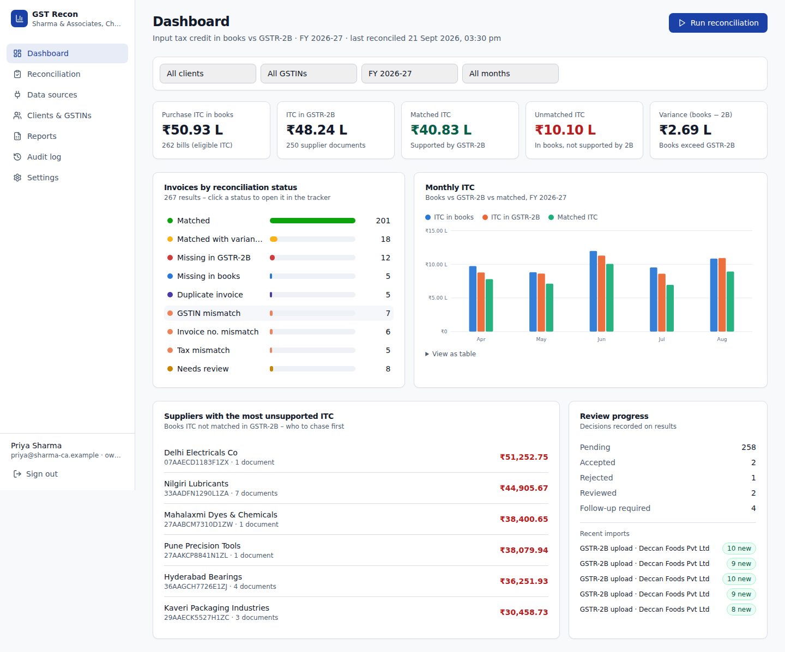
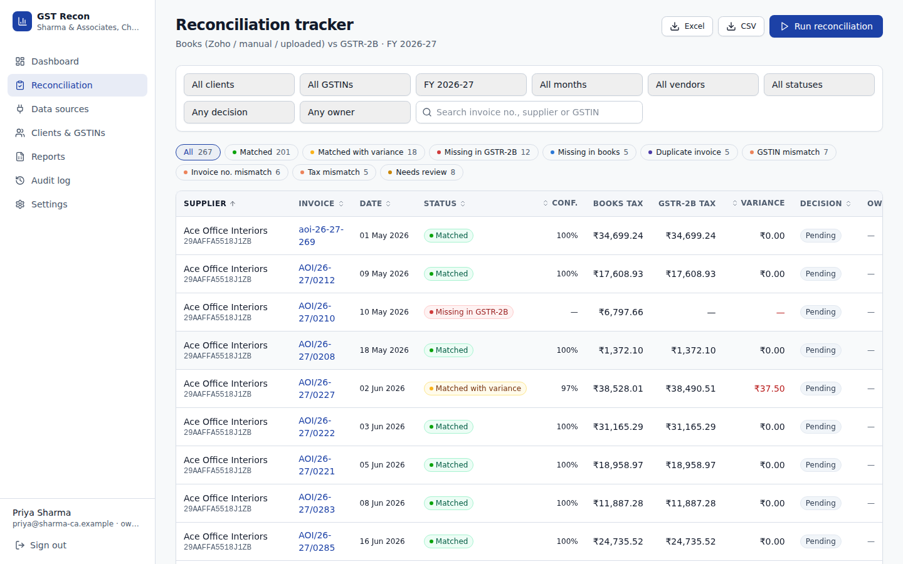
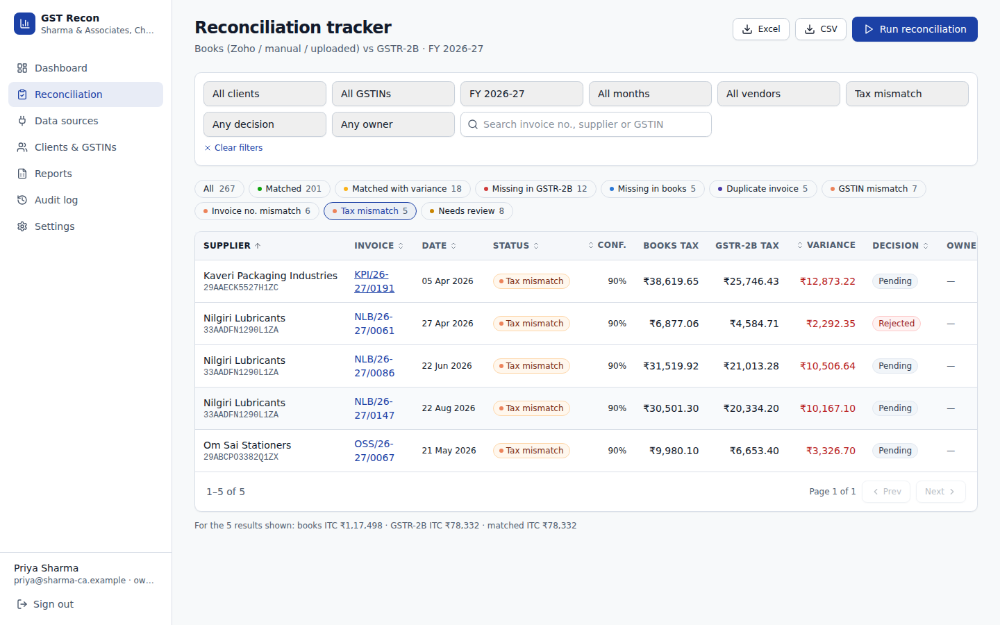
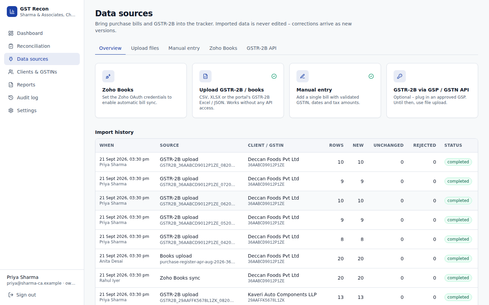
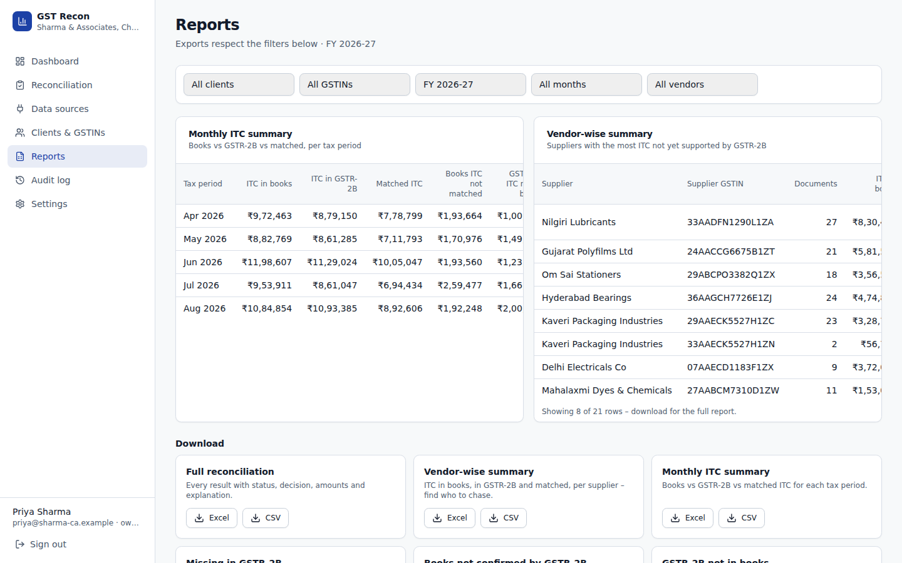
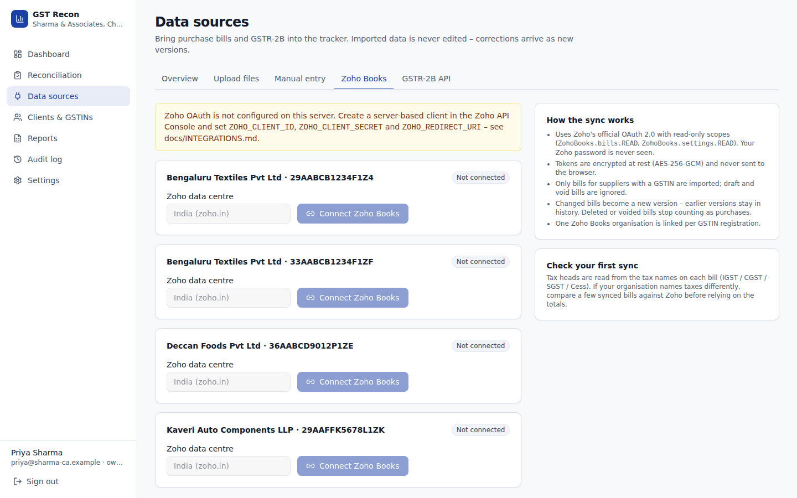
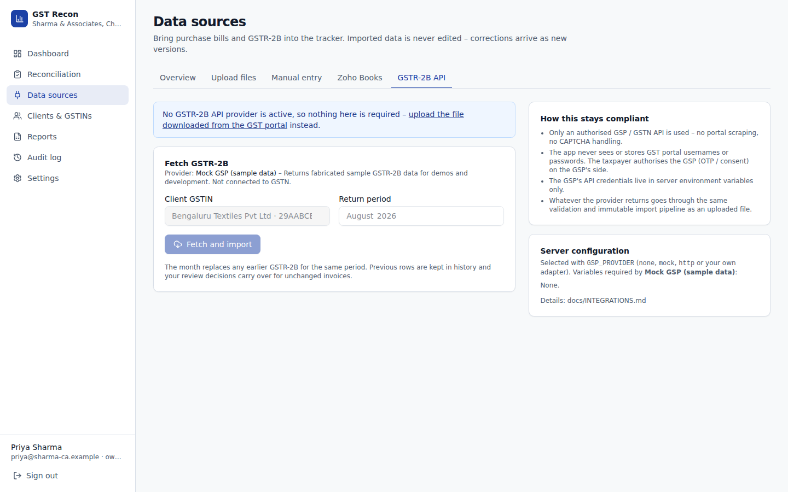
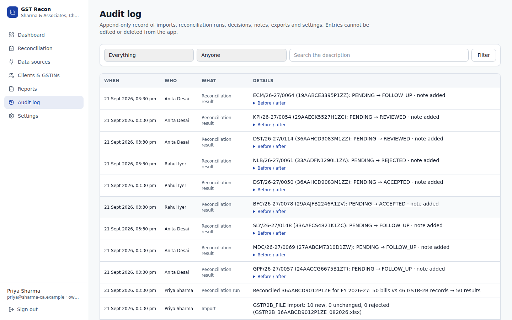
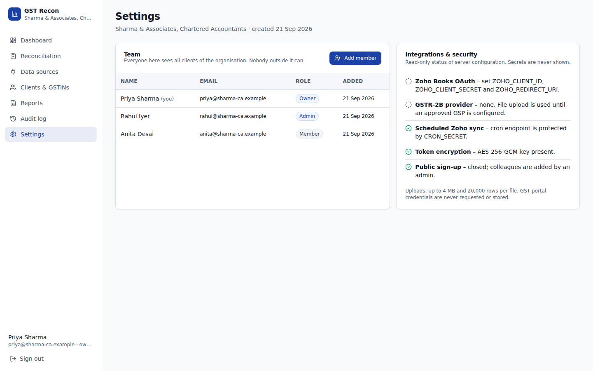

# GST Reconciliation Tracker

A reconciliation tracker for accountants and businesses: match purchase bills from **Zoho Books**, manual entry, or a spreadsheet against **GSTR-2B**, see input tax credit (ITC) at risk, and track follow-ups to closure.



<details>
<summary>More screenshots</summary>

| | |
|---|---|
|  |  |
|  |  |
|  |  |
|  |  |

</details>

> A short screen recording (upload → reconcile → review → export) belongs here as `docs/screenshots/walkthrough.gif` — record one from your own deployment and add it; none is committed since it would show fabricated demo data anyway.

## Why this exists

Every month, an accountant pulls purchase bills from books, downloads GSTR-2B from the GST portal, and manually cross-checks them in a spreadsheet: same invoice, does the GSTIN match, does the tax match, did the supplier even file it? This app automates that comparison, keeps a record of every decision made on an exception, and produces the reports a client or a GST audit will ask for — without ever touching the GST portal itself (see [Integration rules](#integration-rules--whats-off-limits) below).

## Features

- **Dashboard** — ITC in books vs GSTR-2B, matched/unmatched/variance, invoice counts by status, monthly trend, top suppliers by unsupported ITC.
- **Clients & GSTINs** — one firm, many clients, each with one or more GSTIN registrations and financial years; every view is filterable by client, GSTIN, month, vendor and status.
- **Four ways to bring in data**: Zoho Books via official OAuth (auto-sync), GSTR-2B/books CSV or XLSX upload (with downloadable templates), manual bill entry, and an optional GSP/GSTN API for GSTR-2B.
- **Matching engine** — normalises invoice numbers, matches on supplier GSTIN + invoice number + date + amounts, exact then fuzzy (with a confidence score and a plain-English explanation), and classifies every document into one of nine statuses (Matched, Matched with variance, Missing in GSTR-2B, Missing in books, Duplicate invoice, GSTIN mismatch, Invoice number mismatch, Tax mismatch, Needs review). Full write-up: [`docs/RECONCILIATION.md`](docs/RECONCILIATION.md).
- **Reconciliation tracker** — search, filter, sort, paginate; side-by-side books vs GSTR-2B comparison; accept/reject/review/flag-for-follow-up with notes, an owner and a due date; full audit trail.
- **Reports** — full reconciliation, vendor-wise summary, monthly ITC summary, missing-in-2B, books-not-in-2B, GSTR-2B-not-in-books, and variance, each exportable as CSV or XLSX.
- **Multi-tenant & auditable** — every organisation sees only its own data; OAuth tokens are encrypted at rest; imported documents are never edited in place — corrections come in as new versions and reviewer decisions are stored separately, so nothing is ever silently overwritten.

## Integration rules (what's off-limits)

- Zoho Books access is **only** through Zoho's official OAuth 2.0 authorization-code flow, with read-only scopes.
- GSTR-2B comes from a file you upload, or from an **authorised GSP/GSTN API** you configure — never from the GST portal's own web UI.
- The app never scrapes the GST portal, never automates or bypasses a CAPTCHA, and has no code path that accepts, stores or transmits a GST portal username, password or OTP.

See [`docs/INTEGRATIONS.md`](docs/INTEGRATIONS.md) for exactly how each integration works, and [`SECURITY.md`](SECURITY.md) for the security design.

## Tech stack

| | |
|---|---|
| Framework | Next.js 15 (App Router), React 19, TypeScript (strict) |
| UI | Tailwind CSS, shadcn/ui-style components (Radix primitives), lucide-react |
| Database | PostgreSQL + Prisma ORM |
| Auth | NextAuth (credentials + JWT sessions) |
| File parsing | ExcelJS, PapaParse |
| Testing | Vitest (unit + database integration tests) |
| CI/CD | GitHub Actions → Vercel |
| Hosting | Vercel (app) + Supabase or Neon (Postgres) |

## Quick start (local development)

**Prerequisites:** Node.js ≥ 20.11 (see `.nvmrc`), and either Docker or a local PostgreSQL 16.

```bash
git clone <this-repo-url>
cd gst-reconciliation-tracker
npm install
cp .env.example .env
```

Fill in `.env`: at minimum, `DATABASE_URL`/`DIRECT_URL`, `NEXTAUTH_SECRET` (`openssl rand -base64 32`), and `ENCRYPTION_KEY` (`openssl rand -base64 32`). Everything else (Zoho, GSP, cron) is optional — the app runs fully on file upload and manual entry without them.

**Database**, either:

```bash
docker compose up -d db          # PostgreSQL in Docker, matching the .env.example defaults
```

or point `DATABASE_URL`/`DIRECT_URL` at your own PostgreSQL instance.

```bash
npm run db:migrate     # apply migrations (creates the schema)
npm run db:seed        # optional: realistic demo data (see below)
npm run dev            # http://localhost:3000
```

If you seeded demo data, sign in with `priya@sharma-ca.example` / the password printed by the seed script (default `DemoPass#2026`, or whatever you set `SEED_PASSWORD` to). Otherwise, the first visit to `/register` creates your organisation and owner account — sign-up is automatically closed to everyone else afterwards (see `ALLOW_SIGNUP` in `.env.example` if you need multiple self-serve organisations).

### Demo data

`npm run db:seed` creates a fictional CA firm ("Sharma & Associates") with three clients, four GSTIN registrations, five months of purchase bills and GSTR-2B records, and a deliberate mix of every reconciliation status — it runs through the real import pipeline and the real matching engine, so it doubles as a smoke test. It's idempotent (skips if the demo firm already exists) and refuses to run in production unless `SEED_ALLOW_PRODUCTION=true`. Re-seed from scratch with `SEED_RESET=true npm run db:seed`.

### Running the test suite

```bash
npm run lint        # ESLint
npm run typecheck   # tsc --noEmit
npm test            # unit tests — matching engine, parsers, validation, crypto (no database needed)
npm run test:db     # integration tests against a real Postgres — import → reconcile → decisions → tenant isolation → Zoho sync (mocked HTTP)
```

`npm run test:db` needs `DATABASE_URL`/`DIRECT_URL` pointed at a migrated database; it creates and cleans up its own throwaway organisations, so it's safe to run against your dev database.

## Deploying

### Vercel + Supabase/Neon (recommended)

1. **Database**: create a Supabase or Neon Postgres project.
   - Supabase: use the **pooled** connection string (port 6543, `?pgbouncer=true&connection_limit=1`) as `DATABASE_URL`, and the **direct** connection string (port 5432) as `DIRECT_URL` (Prisma needs a direct connection for migrations).
   - Neon: use the pooled host (`...-pooler...`) as `DATABASE_URL` and the non-pooled host as `DIRECT_URL`, both with `?sslmode=require`.
2. **Import the repo into Vercel** (New Project → import from GitHub). Framework preset: Next.js (auto-detected).
3. **Environment variables**: add everything from `.env.example` that applies to you under Project → Settings → Environment Variables. At minimum: `DATABASE_URL`, `DIRECT_URL`, `NEXTAUTH_URL` (your production URL), `NEXTAUTH_SECRET`, `ENCRYPTION_KEY`. Add `CRON_SECRET` if you want the daily Zoho sync (`vercel.json` already defines the cron job), and the `ZOHO_*` / `GSP_*` variables if you're using those integrations.
4. **Deploy.** The build command (`vercel-build` in `package.json`) runs `prisma generate && prisma migrate deploy && next build`, so your migrations are applied automatically on every deploy — no separate migration step needed.
5. Visit the deployed URL, go to `/register`, and create your organisation. Add `ALLOW_SIGNUP=false`-equivalent behaviour is already the default after the first account exists (see above) — add colleagues from **Settings** instead.

### Docker (self-hosting)

```bash
cp .env.example .env    # fill in NEXTAUTH_SECRET, ENCRYPTION_KEY at minimum
docker compose up --build
```

This starts PostgreSQL, runs migrations once (`migrate` service), then starts the app on `http://localhost:3000` (`APP_PORT` in `.env` to change the port). To seed demo data into the containerised database: `docker compose run --rm migrate npx prisma db seed`. The `Dockerfile` also has a plain `runner` target if you want to build just the app image for your own orchestration — apply migrations separately with the `migrate` target or `npx prisma migrate deploy` against your production database.

## Project structure

```
prisma/
  schema.prisma          Data model (see below)
  migrations/             SQL migrations (committed, applied with `prisma migrate deploy`)
  seed.ts                 Demo data generator
src/
  app/
    (auth)/               Login, registration (public)
    (app)/                 Dashboard, clients, sources, reconciliation, reports, audit, settings (signed-in)
    api/                   Route handlers — auth, clients, imports, reconciliation, reports, zoho/*, gsp/*, cron
  components/              UI components (components/ui/ = shadcn-style primitives)
  lib/
    reconcile/             The matching engine (pure functions) + the DB-facing run() wrapper
    import/                File parsing, validation, normalisation, immutable persistence
    zoho/                  Zoho OAuth client, bill mapper, sync orchestration
    gsp/                   Pluggable GSTR-2B provider interface + built-in providers
    *.ts                   Auth/session, audit log, crypto, GSTIN/date/money validation, filters, dashboard/report queries
tests/                     Vitest unit tests (no DB) + tests/integration.test.ts (needs a real Postgres)
docs/                      Design notes referenced from this README
.github/                   CI workflow, issue templates, PR template
```

## Data model

See `prisma/schema.prisma` for the full definitions (with comments). At a glance:

`Organization` → `User` (role: Owner/Admin/Member) · `Organization` → `Client` → `GstinRegistration` → `TaxPeriod` (one per month per financial year) · `Vendor` (deduplicated supplier per organisation) · `Invoice` (a books document — Zoho/upload/manual, immutable, versioned via `supersededAt`/`supersededById`) · `Gstr2bRecord` (same immutability model, sourced from upload or GSP) · `ImportJob` (one per upload/sync/GSP fetch, with per-row error detail) · `ZohoConnection` (encrypted tokens, one per GSTIN registration) · `ReconciliationRun` → `ReconciliationResult` (one per matched pair or unmatched document; carries the human decision, assignee and due date) · `Comment` (notes/follow-ups on a result) · `AuditLog` (append-only).

## Contributing

See [`CONTRIBUTING.md`](CONTRIBUTING.md) — commit convention, local checks to run before opening a PR, and the multi-tenancy/immutability rules new code needs to follow. Please report security issues privately per [`SECURITY.md`](SECURITY.md) rather than as a public issue.

## License

[MIT](LICENSE)
